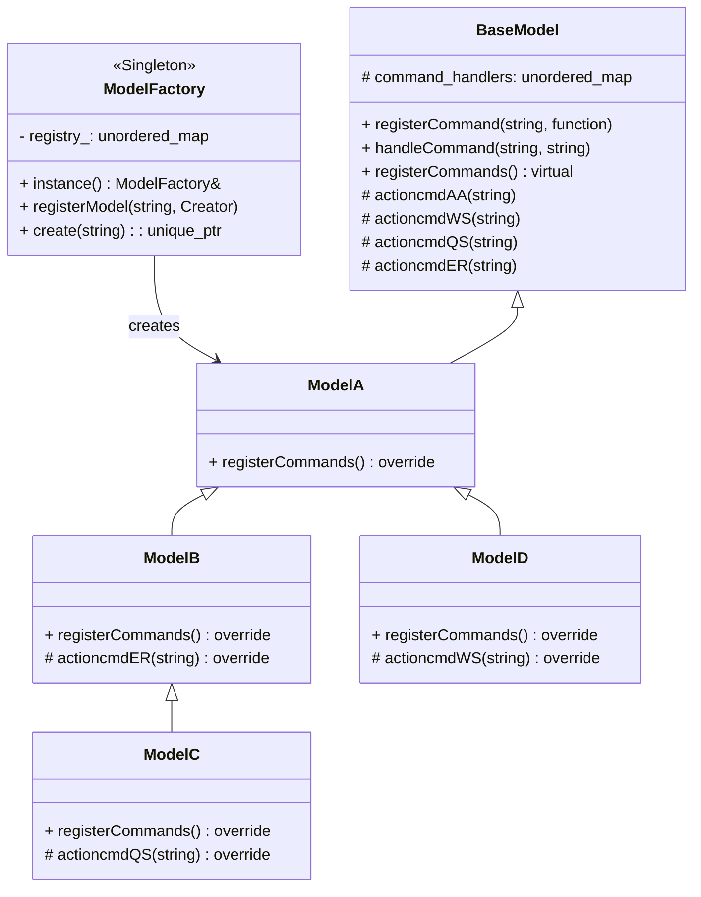

# 核心功能
实现了一个基于命令模式的模型管理系统，支持通过命令行交互动态创建不同设备模型（A/B/C/D）并处理特定指令。主要特性包括：

* 支持输入格式 @[设备类型][指令][参数]*（如 @BQS42*）
* 内置 AA/WS/QS/ER 四种基础指令处理
* 通过继承机制实现不同模型的差异化指令处理
* 使用工厂模式实现模型动态创建

# 关键模块

* ModelFactory：实现设备模型的注册和创建
* BaseModel：定义命令处理基础框架（注册/执行命令）
* ModelA：基础模型实现（派生子类 B/C/D 实现差异化行为）
* Main：实现命令行解析和交互逻辑


# 类图 (Mermaid)



# 关键设计特点

1. 继承关系

* ModelB 继承自 ModelA，覆盖 ER 指令处理
* ModelC 继承自 ModelB，覆盖 QS 指令处理
* ModelD 继承自 ModelA，覆盖 WS 指令处理
2. 工厂模式

* 解耦客户端与具体实现

    main.cpp 等客户端代码只需通过 ModelFactory 接口创建模型，无需直接依赖 ModelB/ModelC 等具体子类，降低模块间耦合度。
* 灵活扩展性

    新增模型类型（如 ModelE）时只需通过 DEVICE_REGISTER("E", ModelE) 注册 无需修改工厂类或客户端代码。

* 运行时动态绑定

    客户端代码在运行时根据输入的设备类型动态创建对应的模型实例，实现了运行时多态。根据用户输入动态创建对应模型（如输入 @B* 创建 ModelB），实现类似插件的热插拔功能。
* 集中控制逻辑
    
    在 ModelFactory::create() 中统一添加初始化逻辑（如调用 model->registerCommands()），保证所有模型实例行为一致性。

3. 命令处理

    每个模型的 registerCommands() 方法通过 Lambda 表达式绑定成员函数：
    ```cpp
    registerCommand("QS", [this](auto&& content) { actioncmdQS(content); });
    ```

4. 单例模式
    在 ModelFactory 类中实现单例模式，确保全局唯一工厂实例用于管理设备模型的注册与创建。

主要作用：
* 统一注册中心：通过单例保证所有模型的 DEVICE_REGISTER 宏注册到同一个工厂
* 简化访问：可通过 ModelFactory::instance() 直接获取全局实例
