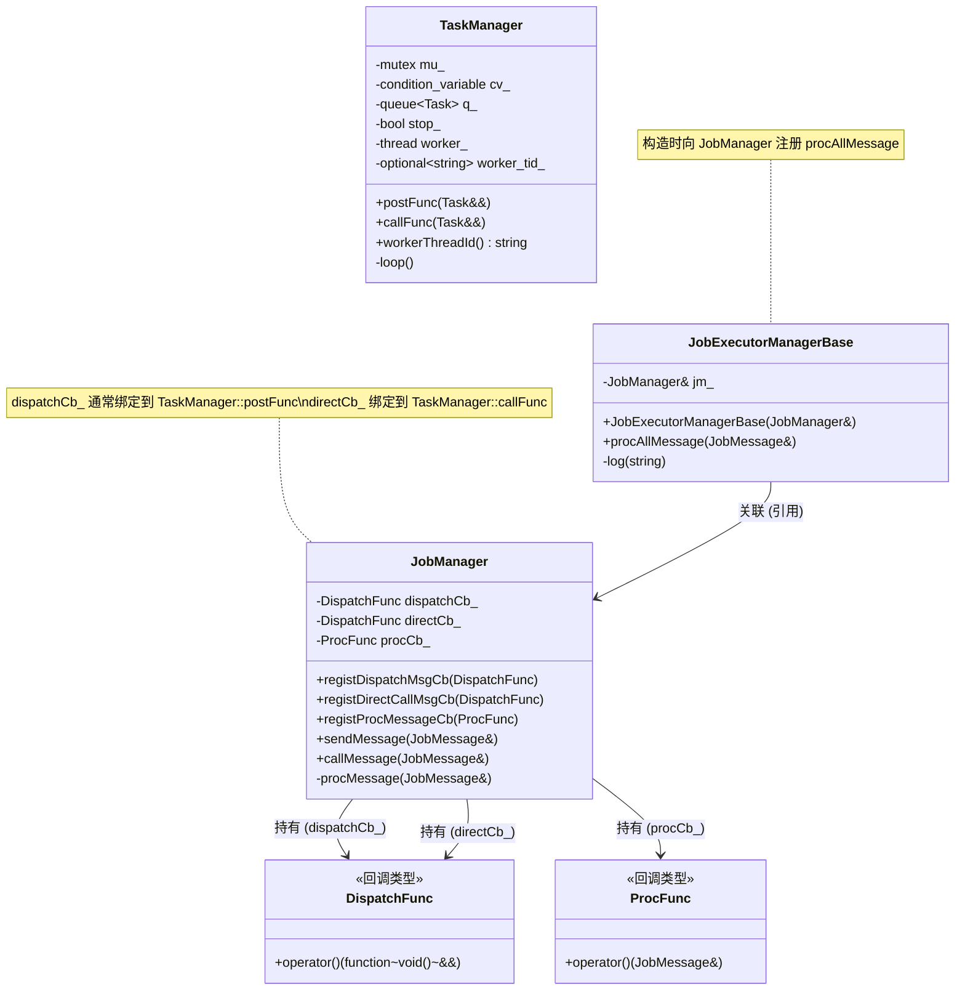

# Demo：为什么要把处理逻辑“bind 成任务”再投递

- `JobManager::sendMessage()` 不直接调用处理逻辑，而是把 `procMessage(msg)` **封装成 `std::function<void()>`** 任务交给 `dispatchMessageCb_`
- `dispatchMessageCb_` 决定这个任务 **在哪个线程、何时、按什么顺序** 执行（例如投递到事件循环/线程池）
- `registProcMessageCb()` 只决定“真正的处理函数是谁”（这里用 `JobExecutorManagerBase::procAllMessage` 模拟）

## 类图

典型的事件驱动、线程模型解耦的框架。三个类各司其职，通过回调机制协作，实现了**消息的发送、调度与处理**的分离。



## 1. 类职责

| 类 | 核心职责 | 关键能力 |
|---|---|---|
| **TaskManager** | **任务执行环境** | 拥有一个独立的工作线程 + 任务队列；提供 `postFunc`（异步排队）和 `callFunc`（立即执行）两种执行方式。 |
| **JobManager** | **消息路由与生命周期** | 对外提供 `sendMessage`（异步投递）和 `callMessage`（同步直调）；内部通过回调函数（`DispatchMessageFunc` / `DirectCallMessageFunc`）将“消息处理函数”转发给底层的执行器。 |
| **JobExecutorManagerBase** | **业务逻辑处理** | 实现具体的 `procAllMessage` 方法；在构造时向 `JobManager` 注册消息处理回调。 |

### 2. 类之间的关系

- **JobManager** 与 **TaskManager**：**间接依赖**  
  `JobManager` 不直接持有 `TaskManager`，而是通过两个 `std::function` 回调（`dispatchMessageCb_` / `directCallMessageCb_`）与外界连接。在 `main()` 中，这些回调被绑定到 `TaskManager` 的 `postFunc` 和 `callFunc`。  
  → 实现了 **编译期解耦**：`JobManager` 无需知道 `TaskManager` 的存在，只要求回调符合 `void(std::function<void()>&&)` 的签名。

- **JobExecutorManagerBase** 与 **JobManager**：**关联关系**  
  `JobExecutorManagerBase` 持有 `JobManager&` 引用，并在构造时将自己的 `procAllMessage` 注册给 `JobManager`。  
  → `JobManager` 知道“谁来处理消息”（通过 `ProcMessageFunc` 回调），而 `JobExecutorManagerBase` 知道“把处理结果发给谁”。

- **JobExecutorManagerBase** 与 **TaskManager**：**无直接关系**  
  业务逻辑完全不感知任务是在哪个线程、以何种方式执行的。这正是解耦的成果。

### 3. 整体协作流程（以 `sendMessage` 为例）

``` bash
用户代码 → JobManager::sendMessage()
         → dispatchMessageCb_( bind(procMessage, msg) )
             → 该回调在 main 中被设为 TaskManager::postFunc()
                 → 任务入队 → 工作线程出队执行
                     → 调用 JobManager::procMessage (内部再调用注册的 ProcMessageFunc)
                         → JobExecutorManagerBase::procAllMessage
```

`callMessage` 则跳过队列，直接在调用线程执行。

## 4. 这样设计的优点

| 优点 | 解释 |
|---|---|
| **线程切换与串行化** | `sendMessage` 的消息全部在 `TaskManager` 的工作线程中串行执行，无需用户关心锁竞争。`callMessage` 提供同步调用选项。 |
| **解耦消息收发与执行细节** | `JobManager` 不需要知道任务是被投递到线程池、单线程队列还是立即执行。只要回调满足接口，执行方式可以随时替换。 |
| **业务逻辑与基础设施分离** | `JobExecutorManagerBase` 只关注 `JobMessage` 的处理，不涉及任何线程、锁、队列。便于单元测试和复用。 |
| **统一的任务封装形式** | 通过 `std::bind` 将 `procMessage(msg)` 转化为 `void()` 任务，屏蔽了参数差异，使 `TaskManager` 可以处理任意可调用对象。 |
| **支持不同的调用语义** | `sendMessage` 对应“发后即忘”的异步语义，`callMessage` 对应同步请求-响应语义。两者可共存。 |
| **便于扩展** | 若要增加消息优先级、延迟投递、批量处理等，只需修改 `TaskManager` 或增加新的 `JobManager` 回调，业务层无感知。 |

## Ubuntu 下编译运行

在仓库根目录执行：

```bash
cd demo
mkdir -p build
cd build
cmake ..
cmake --build . -j
./job_schedule_demo
```

## 运行结果

- `callMessage()`：**立刻在调用者线程**执行（demo 里是主线程）
- `sendMessage()`：**排队到事件循环线程**执行（demo 里是 `TaskManager` 的 worker 线程）
- 连续多次 `sendMessage()`：会在事件循环线程里 **按队列顺序串行处理**（更容易保证状态机逻辑不被并发重入）

